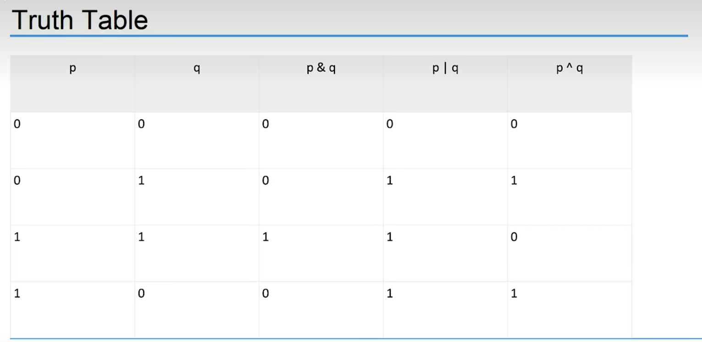

# C-Programming

## Basics

- computers are very dumb machines
  - they only do what they are told to do
- the basic operations of a computer will form what is known as the computer's instruction set
- to solve a problem using a computer, you must provide a solution to the problem
  by sending instructions to the instruction set
  - a computer programs sends the instructions necessary to solve a specific problem
- the approach or method that is used to solve the problem is known as an algorithm
  - so, if we were to create a program that tests if a number is odd or even
    - the statements that solve the problem becomes the program
    - the method this is used to test if the number is even or odd is the algorithm
- to write a program, you need to write instructions necessary to implement the algorithm
  - these instructions would be expressed in the statements of a particular computer language,
    such as Java, C++, Objective-C, or C

## Terminology

- CPU (center processing unit)
  - does most of the computing work
  - Instructions are executed here
- RAM (random access memory)
  - stores the data of program while it is running
- hard drive (permanent storage)
  - Store files that contain program source code, even while the computer is turned off
- Operating system
  - developed to help make it more convenient to use computers
  - a program that controls the entire operation of a computer
    - all input and output
    - manages the computer's resources and handles the execution of programs
    - windows, unix, Android, etc
- fetch / execute cycle (life of a cpu)
  - fetches an instruction from memory(using registers) and executes it (loop)
  - A gigahertz CPU can do this about a billion times a second
    

## Higher Level Programming Language

- High-level programming languages make it easier to write programs
  - opposite of assembly language
  - C is a higher level programming language that describe actions in a more abstract form
  - the instructions(statements) of a program look more like problem-solving steps
  - do not have to worry about the precise steps a particular CPU would have to take to accomplish a particular task
    - total = x +vs. mv ax, 5, mv cs 4, etc...
- compilers
  - a program that translates the high-level language source code into the detailed set of machine language
    instructions the computer requires
  - the program does the high-level thinking and the compiler generates the tedious instructions to the cpu
- compilers will also check that your program has valid syntax for the programming language that you are compiling
  - find errors and it reports them to you and doesn't produce an executable until you fix them
- higher-level languages are easier to learn and much easier to program in than are machine languages

## writing a program

- the act of writing C program can be broken down into multiple steps
  

1. define the program objectives
   - understand the requirements of the program
   - get a clear idea of what you want the program to accomplish
2. design
   - decide how the program will meet the above requirements
   - what should the user interface be like?
   - how should the program be organized?
3. write the code
   - start implement, translate the design in syntax of C
   - you need to use a text editor to create what is called a _source code_ file
4. compile
   - translate the source code into machine code (executable code)
   - consists of detailed instructions to the CPU expressed in a numeric code
5. run the program
   - the executable file is a program you can run
6. test and debug
   - just because a program is running, does not mean it works as intended
   - need to test, to see that your program does what it is supposed to do(may find bugs)
     - debugging is process of finding and fixing program errors
     - making mistakes is a natural part of learning
7. maintain and modify the program
   - programs are released and used by many people
   - have to continue to fix new bugs or add new features

## printf format specifiers

## Arithmetic operators in C

## logical operators in C

## assignment operators in C

## relational operators in C

## bitwise operators (tutorial point)

## truth table
